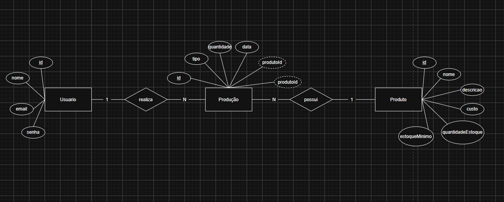

# DER

# 1 - Lista de Requisitos Funcionais

## RF01 - Interface de Autenticação

- [RF01.1] Solicitar email e senha do usuário
- [RF01.2] Validar as credenciais informadas
- [RF01.3] Informar ao usuário quando houver erro de autenticação
- [RF01.4] Criar uma sessão para o usuário autenticado
- [RF01.5] Redirecionar o usuário autenticado para a interface principal
- [RF01.6] Impedir o acesso às interfaces protegidas quando o usuário não estiver autenticado

## RF02 - Interface Principal

- [RF02.1] Exibir o nome do usuário autenticado
- [RF02.2] Exibir menu de navegação do sistema
- [RF02.3] Permitir acesso à interface de cadastro de produtos
- [RF02.4] Permitir acesso à interface de gestão de produção
- [RF02.5] Permitir que o usuário realize logout
- [RF02.6] Redirecionar o usuário para a tela de login após o logout

## RF03 - Cadastro de Produtos

- [RF03.1] Listar os produtos cadastrados no banco de dados
- [RF03.2] Carregar automaticamente os produtos ao acessar a interface
- [RF03.3] Permitir buscar produtos pelo nome
- [RF03.4] Atualizar a listagem conforme o termo pesquisado
- [RF03.5] Permitir cadastrar um novo produto
- [RF03.6] Permitir informar nome, descrição, custo, quantidade em estoque e estoque mínimo
- [RF03.7] Validar os dados informados no cadastro do produto
- [RF03.8] Permitir editar um produto existente
- [RF03.9] Permitir excluir um produto existente
- [RF03.10] Atualizar a listagem após cadastro, edição ou exclusão
- [RF03.11] Permitir retornar para a interface principal

## RF04 - Gestão de Produção

- [RF04.1] Listar os produtos cadastrados no sistema
- [RF04.2] Organizar os produtos em ordem alfabética
- [RF04.3] Permitir selecionar um produto para realizar uma movimentação
- [RF04.4] Permitir selecionar o tipo de movimentação
- [RF04.5] Registrar movimentação do tipo fabricado
- [RF04.6] Aumentar o estoque quando uma movimentação do tipo fabricado for registrada
- [RF04.7] Registrar movimentação do tipo pedido
- [RF04.8] Diminuir o estoque quando uma movimentação do tipo pedido for registrada
- [RF04.9] Permitir informar a data da movimentação
- [RF04.10] Registrar a quantidade movimentada
- [RF04.11] Registrar o usuário responsável pela movimentação
- [RF04.12] Verificar automaticamente o estoque após uma movimentação de saída
- [RF04.13] Informar um alerta quando o estoque ficar abaixo do estoque mínimo
- [RF04.14] Atualizar a quantidade de estoque após a movimentação
